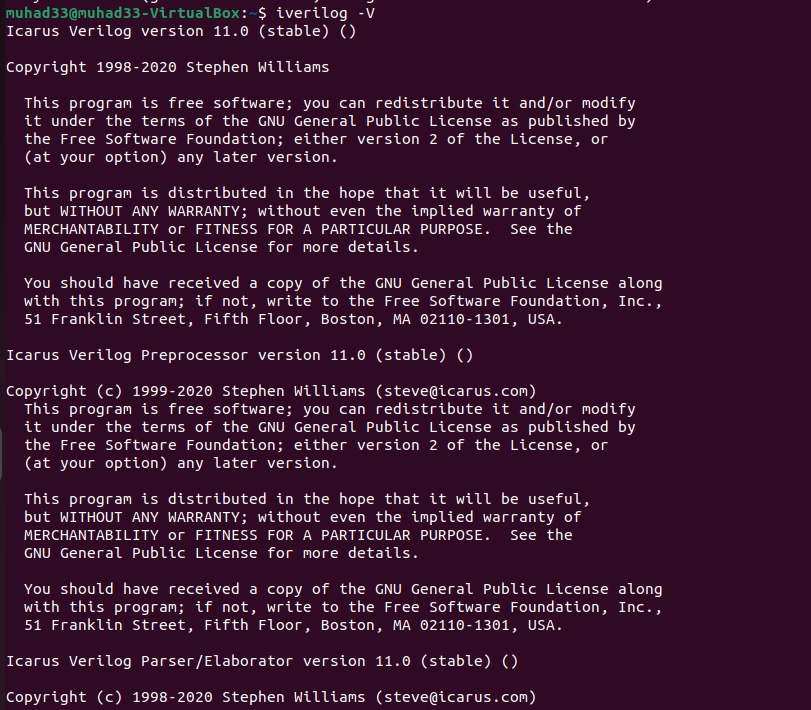
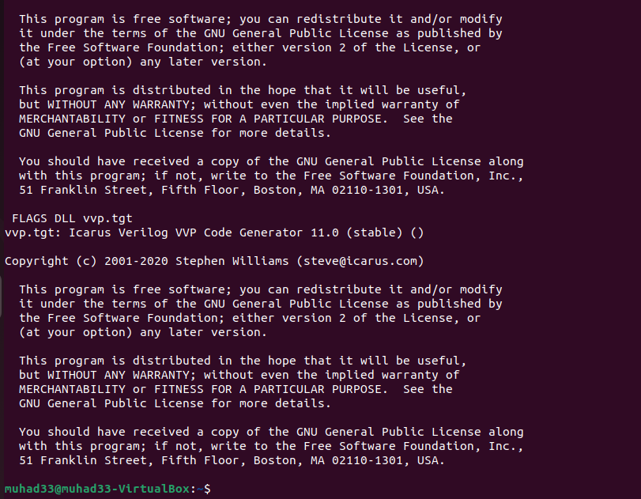
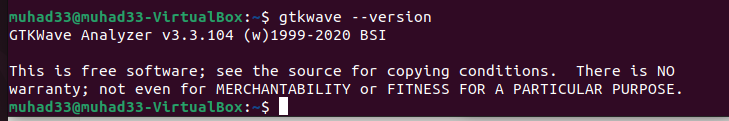
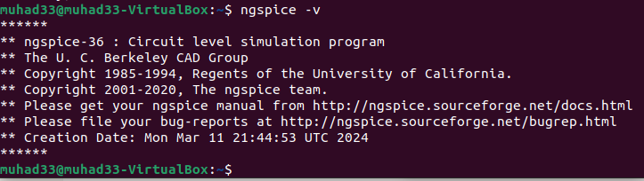
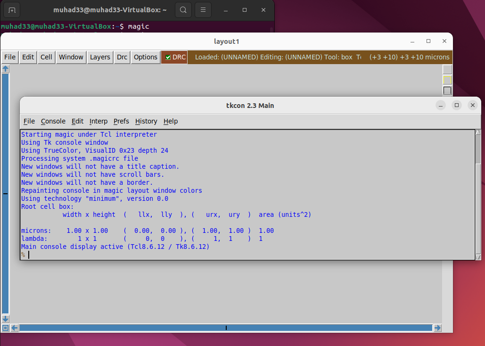

# 🚀 Week 0: VLSI System Design Program Foundation & Tool Setup

Welcome to the VLSI System Design (VSD) Project repository! This initial week focuses on setting up a robust development environment essential for successful RTL synthesis, simulation, circuit analysis, and layout design. The goal is to establish a reliable workspace with all necessary open-source EDA tools installed, verified, and ready for use.

---

## 🎯 System and Virtual Machine Configuration

The development environment is configured using a Virtual Machine optimized for VLSI toolchain performance.

| Specification        | Details         |
|----------------------|-----------------|
| Operating System     | Ubuntu 20.04+   |
| RAM                  | 6 GB            |
| Storage              | 50 GB           |
| vCPUs                 | 4               |

> 💡 *Pro Tip:* This configuration ensures sufficient resources for synthesis, simulation, and overall VLSI design workflows.

---

## ⚙️ Tool Installation & Verification

We installed and verified the following core tools, fundamental for the VLSI design and simulation process:

| Tool           | Purpose                          | Installation Status |
|----------------|---------------------------------|---------------------|
| **Yosys**      | RTL synthesis                   | ✅ Completed        |
| **Icarus Verilog** | Verilog simulation            | ✅ Completed        |
| **GTKWave**    | Waveform visualization           | ✅ Completed        |
| **ngspice**    | Analog and mixed-signal simulation | ✅ Completed        |
| **Magic VLSI** | Layout creation and DRC         | ✅ Completed        |

---

### 🧠 1. Yosys – RTL Synthesis Tool

**Purpose:** Converts RTL Verilog code into gate-level representation with optimization passes.

**Installation Overview:**

```bash
git clone https://github.com/YosysHQ/yosys.git
cd yosys
sudo apt install make build-essential clang bison flex libreadline-dev gawk tcl-dev libffi-dev git graphviz xdot pkg-config python3 libboost-system-dev libboost-python-dev libboost-filesystem-dev zlib1g-dev
make
sudo make install
```
 
## 📷  Verification


✅ **Yosys Successfully Installed**


---

### 📟 2. Icarus Verilog – Verilog Simulator

**Purpose:** Functional Verilog simulation supporting IEEE-1364 standard.

**Installation:**

```bash
sudo apt-get install iverilog
```

## 📷  Verification




✅ **Iverilog Successfully Installed**


---

### 📊 3. GTKWave – Waveform Viewer

**Purpose:** Visualize simulation waveforms for debugging and analysis.

**Installation:**

```bash
sudo apt update
sudo apt install gtkwave
```

## 📷  Verification



✅ **GTKWave Successfully Installed**

---

### ⚡ 4. Ngspice – Circuit Simulator

**Purpose:** Analog and mixed-signal circuit simulation based on SPICE.

**Installation:**

```bash
sudo apt update
sudo apt install ngspice
```

## 📷  Verification



✅ **Ngspice Successfully Installed**
---

### 🎨 5. Magic VLSI – Layout Tool

**Purpose:** VLSI layout editing with DRC capabilities.

**Installation:**

```bash
sudo apt-get install m4 tcsh csh libx11-dev tcl-dev tk-dev libcairo2-dev mesa-common-dev libglu1-mesa-dev libncurses-dev
git clone https://github.com/RTimothyEdwards/magic.git
cd magic
./configure
make
sudo make install
```

## 📷  Verification



✅ **Magic VLSI Successfully Installed**

---

## 🎉 Installation Summary

| Tool           | Status     | Primary Use               |
|----------------|------------|---------------------------|
| Yosys          | ✅ Complete | RTL synthesis             |
| Icarus Verilog | ✅ Complete | Verilog simulation        |
| GTKWave        | ✅ Complete | Waveform analysis         |
| ngspice        | ✅ Complete | Circuit simulation        |
| Magic VLSI     | ✅ Complete | Layout design             |

---

## 🚀 Environment Ready for VLSI Design Journey!

With this solid setup in place, the project is primed for progressing to hardware description, simulation flows, and eventually FPGA prototyping and tapeout stages.

---

## 📚 Repository & Author

**Repository:** [Muhad33_RISC-V-SoC-Tapeout-Program]  
**Author:** Muhammed Muhad
